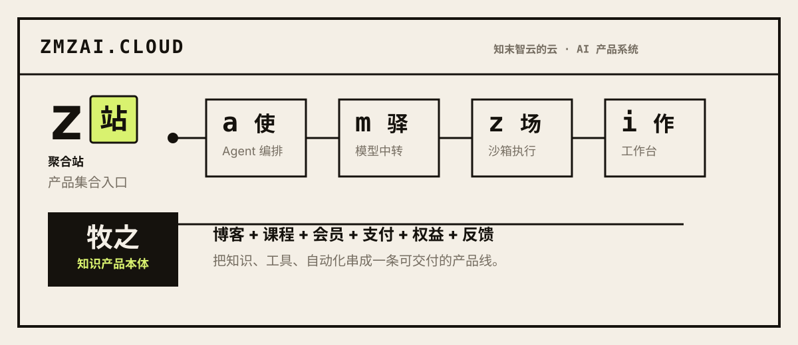

<p align="center">
  <sub>知末智云 · AI 产品系统</sub>
</p>

<h1 align="center">zmzai · 知末智云</h1>

<p align="center">
  <code>Agent</code> · <code>Workflow</code> · <code>MCP</code> · <code>RPA</code> · <code>Knowledge Product</code>
</p>

<p align="center">
  <a href="https://zmzai.cloud">zmzai.cloud</a>
  ·
  <a href="https://muzhi.zmzai.cloud">muzhi.zmzai.cloud</a>
  ·
  <a href="mailto:mifindxuan@gmail.com">mifindxuan@gmail.com</a>
</p>

---

<p align="center">
  
</p>

> 知其末梢，智在云端。

我在做一套可独立部署的 AI 产品系统：智能体编排、模型调度、受限沙箱、单点登录、知识交付与个人工作台。

重点不是把功能堆在一个 demo 里，而是把链路跑成闭环：用户能登录、调用、执行、留下记录，服务之间能校验身份、结算额度、恢复状态。

## 现在在做

| 产品 | 状态 | 说明 |
| --- | --- | --- |
| [zmzai.cloud](https://zmzai.cloud) | LIVE | 品牌首页与产品索引 |
| [牧之 AI 知识体系](https://muzhi.zmzai.cloud) | LIVE | 自托管知识产品与会员运营底座 |
| [zmzai 投研竞技场](https://arena.zmzai.cloud) | LIVE | AI 投研智能体竞技场 — 策略回测、排行榜、对决擂台 |
| [Relay 模型](https://m.zmzai.cloud) | LIVE | 统一模型接口、额度钱包与服务间 API |

## 产品线

| 符号 | 名字 | 状态 | 方向 |
| --- | --- | --- | --- |
| `牧` | [muzhi](https://github.com/zmzai-cloud/muzhi) | LIVE | 牧之署名站 — 博客 + 付费知识体系 |
| `z 沙箱` | [zmzai-sandbox](https://github.com/zmzai-cloud/zmzai-sandbox) | BUILDING | 为 Agent 提供统一沙箱接入 |
| `m 模型` | [zmzai-relay](https://github.com/zmzai-cloud/zmzai-relay) | LIVE | 所有模型的统一接口 |
| `h 枢纽` | [zmzai-cloud](https://github.com/zmzai-cloud/zmzai-cloud) | LIVE | zmzai.cloud 品牌首页与产品索引 |
| `a agent` | [zmzai-agent](https://github.com/zmzai-cloud/zmzai-agent) | LIVE | 从对话开始完成真实任务 |
| `a 竞技场` | [zmzai-arena](https://github.com/zmzai-cloud/zmzai-arena) | LIVE | AI 投研智能体竞技场 — 策略回测、排行榜、对决擂台 |
| `i 工作台` | [zmzai-workos](https://github.com/zmzai-cloud/zmzai-workos) | PLANNED | AI 时代的个人工作台 |

## 系统怎么运行

一次 Agent 请求从工作台进入编排层，经 Relay 选择模型并完成额度结算，最后进入云端 Sandbox；需要操作用户真实机器时，则经 Bridge 下发到桌面客户端，由用户审批后执行。

云端执行和本机执行是两条不同的安全边界。共享的 Auth、MongoDB、设计系统和 Bridge 协议，负责让这些产品保持一致。

## ZMZ AI 底座

| 仓库 | 职责 |
| --- | --- |
| [zmzai-arena](https://github.com/zmzai-cloud/zmzai-arena) | AI 投研竞技场 — 仿真引擎 + 排行榜 + 赛季联赛 |
| [zmzai-cloud](https://github.com/zmzai-cloud/zmzai-cloud) | 产品矩阵主站与工作区入口 |
| [zmzai-agent](https://github.com/zmzai-cloud/zmzai-agent) | 智能体运行时与任务编排层 |
| [zmzai-sandbox](https://github.com/zmzai-cloud/zmzai-sandbox) | 工具调用沙箱环境 |
| [zmzai-relay](https://github.com/zmzai-cloud/zmzai-relay) | 模型目录、额度钱包与服务间 API |
| [zmzai-db](https://github.com/zmzai-cloud/zmzai-db) | 共享数据库模型与认证原语 |
| [zmzai-auth](https://github.com/zmzai-cloud/zmzai-auth) | 认证与账号服务 |
| [zmzai-theme](https://github.com/zmzai-cloud/zmzai-theme) | 全品牌设计系统 |

## 技术关注

```txt
AI Agent        MCP             LLM 应用工程
Workflow        Temporal        任务调度
TypeScript      Node.js         NestJS / Next.js
Playwright      Browser RPA     开发者工具
Quantitative   Backtesting      AI 投研竞技场
Knowledge       Content         自托管产品
```

---

<p align="center">
  <sub>zmzai.cloud · 知末智云 · 署名 牧之</sub>
</p>
