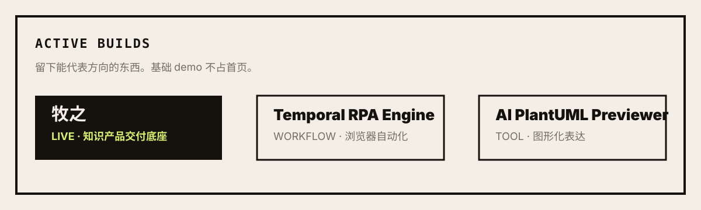

<p align="center">
  <sub>牧之的云 · AI 产品系统</sub>
</p>

<h1 align="center">zmzai · 牧之</h1>

<p align="center">
  <code>Agent</code> · <code>Workflow</code> · <code>MCP</code> · <code>RPA</code> · <code>Knowledge Product</code>
</p>

<p align="center">
  <a href="https://zmzai.cloud">zmzai.cloud</a>
  ·
  <a href="https://muzhi.zmzai.cloud">muzhi.zmzai.cloud</a>
  ·
  <a href="mailto:mifindxuan@gmail.com">mifindxuan@gmail.com</a>
</p>

---

<p align="center">
  
</p>

```txt
作者在场。不自托管即不署名。
```

我在构建 AI 产品、智能体工作区、知识产品和自动化工具。

最近的主线，是把 Agent、Workflow、MCP、RPA、内容系统这些能力做成真正可运行、可交付、可持续迭代的产品。

## 现在可用

| 产品 | 状态 | 说明 |
| --- | --- | --- |
| [牧之 AI 知识体系](https://muzhi.zmzai.cloud) | LIVE | 自托管的知识产品交付与会员运营底座 |
| [zmzai cloud](https://zmzai.cloud) | LIVE | 牧之的云，AI 产品系统与项目集合入口 |
| [中转驿](https://m.zmzai.cloud) | LIVE | 模型与 API 的中转站 |

## 产品线

| 符号 | 名字 | 状态 | 方向 |
| --- | --- | --- | --- |
| `牧` | [牧之](https://github.com/Ulanxx/muzhi) | LIVE | 知识产品、课程、会员、内容交付 |
| `z 场` | [zmzai-sandbox](https://github.com/Ulanxx/zmzai-sandbox) | BUILDING | 受限代码执行与 Agent 实验环境 |
| `m 驿` | [zmzai-relay](https://github.com/Ulanxx/zmzai-relay) | BUILDING | 模型、工具与外部服务转发层 |
| `z 站` | [zmzai-cloud](https://github.com/Ulanxx/zmzai-cloud) | BUILDING | 云端工作区与平台服务 |
| `a 使` | [zmzai-agent](https://github.com/Ulanxx/zmzai-agent) | BUILDING | 可审计的 Agent 任务与编排层 |
| `i 作` | [zmzai-workos](https://github.com/Ulanxx/zmzai-workos) | BUILDING | 组织、账号与团队协作集成 |

## ZMZ AI 底座

| 仓库 | 职责 |
| --- | --- |
| [zmzai-cloud](https://github.com/Ulanxx/zmzai-cloud) | 云端工作区与平台服务 |
| [zmzai-agent](https://github.com/Ulanxx/zmzai-agent) | 智能体运行时与任务编排层 |
| [zmzai-sandbox](https://github.com/Ulanxx/zmzai-sandbox) | 工具调用沙箱环境 |
| [zmzai-relay](https://github.com/Ulanxx/zmzai-relay) | 模型、工具与外部服务转发层 |
| [zmzai-db](https://github.com/Ulanxx/zmzai-db) | 共享数据库模型与认证原语 |
| [zmzai-auth](https://github.com/Ulanxx/zmzai-auth) | 认证与账号服务 |

## 代表构建

<p align="center">
  
</p>

| 项目 | 方向 |
| --- | --- |
| [temporal-rpa-engine](https://github.com/Ulanxx/temporal-rpa-engine) | 基于 Temporal 与 Playwright 的 RPA 流程编排 |
| [ai-plantuml-previewer](https://github.com/Ulanxx/ai-plantuml-previewer) | PlantUML 实时预览与 AI 辅助编辑 |

## 技术关注

```txt
AI Agent        MCP             LLM 应用工程
Workflow        Temporal        任务调度
TypeScript      Node.js         NestJS / Next.js
Playwright      Browser RPA     开发者工具
Knowledge       Content         自托管产品
```

---

<p align="center">
  <sub>zmzai.cloud · 牧之 署名 · OPC 项目集合枢纽站</sub>
</p>
